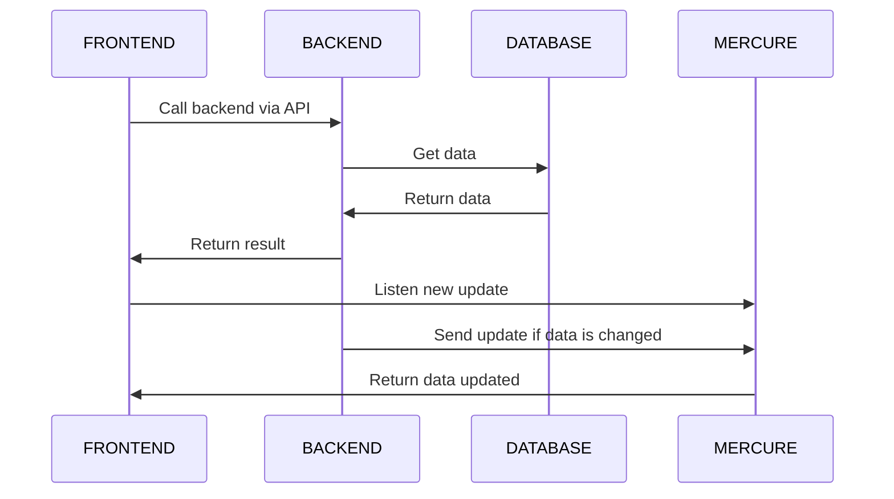

# WORKEE Project

## Technology used

Frontend: ReactJs\
Backend: PHP Symfony\
Hardware: Electron\
Mercure

## Available Scripts

You need to clone the project repository: 
### `git clone https://github.com/Valounte/workee_frontend.git`

In the project directory, you can run:
### `npm install`

For updates dependencies required.

### `npm start`

Runs the app in the development mode.\
Open [http://localhost:3000](http://localhost:3000) to view it in the browser.

The page will reload if you make edits.\
You will also see any lint errors in the console.
